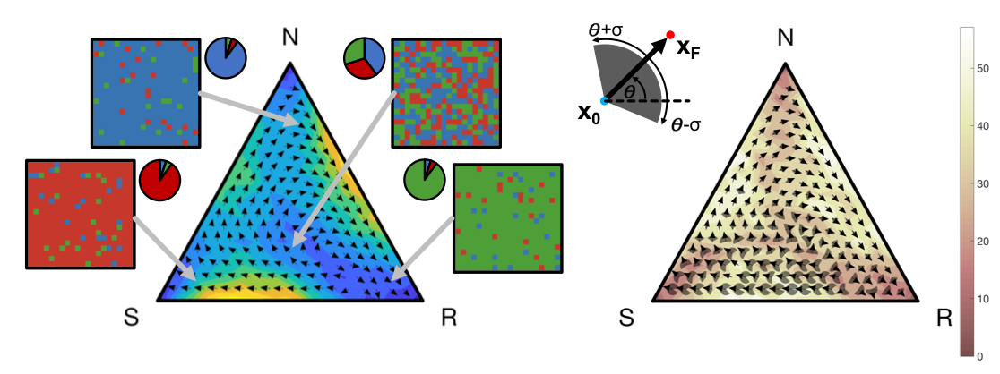

# IsoMaTrix

## Abstract

Evolutionary game theory describes frequency-dependent selection for fixed, heritable strategies in a population of competing individuals using a payoff matrix, typically described using well-mixed assumptions (replicator dynamics). IsoMaTrix is an open-source package which computes the isoclines (lines of zero growth) of matrix games, and facilitates direct comparison of well-mixed dynamics to structured population in two or three dimensions. IsoMaTrix is coupled with a Hybrid Automata Library module to simulate structured matrix games on-lattice. IsoMaTrix can also compute fixedpoints, phase flow, trajectories, velocities (and subvelocities), delineated region plots of positive/negative strategy velocity, and uncertainty quantification for stochastic effects in structured matrix games.

## General Notes

The following functions are available, and explained in detail in the isomatrix manual. Below, is example output from isomatrix (generated by running ‘demo_all_features.m.’

## Isomatrix Functions (MATLAB)
The following set of functions plots isomatrix ternary diagrams for non-spatial replicator dynamics.

- isomatrix(A)
- isomatrix_fixedpoint(A,index)
- isomatrix_quiver(A)
- isomatrix_isocline(A,id)
- isomatrix_trajectory(A,x0,tF)
- isomatrix_region(A)
- isomatrix_velocity(A,id)
- isomatrix_surface(A,id)
- isomatrix_pairwise(A) 

## Helper functions
The following set of functions are helper functions, used for non-spatial replicator dynamics.
- replicator(t,x,A)
- line_plot(A,x0,tF)
- add_labels(string)
- add_gridlines(gridlines)
- XY_to_UVW(p)
- UVW_to_XY(x)
- A_subset(A,types)

## HAL Matrix Games (JAVA)
The following classes are found in the “HALMatrixGame” folder, used for numerically simulating matrix games on a two- or three-dimensional lattice. Full setup instructions are below in “Setting up an Integrated Development Environment”
- HALMatrixGame2D
- Cell2d
- HALMatrixGame3D
- Cell3d

It is recommended to run the “StartHere.java” main function first. This has an example creating a HALMatrixGame2d object, and simulating a single simulation and a meshgrid simulation:
- SingleSimulation(int timesteps)
- MeshGrid(int timesteps, int nSims)

User may also specify the following options:
- Payoffs (3x3 matrix, A)
- FitnessNeighborhood (Moore or Von Neumann)
- PopulationUpdateFraction
- Process (Deterministic or Stochastic Updating)

## Visualizing HALMatrixGames using HAL_isomatrix Functions (MATLAB)

The following set of functions plots numerically estimated isomatrix ternary diagrams for structured populations on two- or three-dimensional lattice. These functions utilize output from HAL simulations (see StartHere.java).
- HAL_isomatrix()
- HAL_isomatrix_trajectory()
- HAL_isomatrix_quiver() 
- HAL_isomatrix_velocity(id)
- HAL_isomatrix_region()
- HAL_isomatrix_uncertainty(id)

## Setting up an Integrated Development Environment (JAVA)
### Before you start
In order to run models built using HAL's' code base, you'll need to download the latest version of [Java](http://www.oracle.com/technetwork/java/javase/downloads/jdk9-downloads-3848520.html) and an editor (we suggest using [IntelliJ Idea](https://www.jetbrains.com/idea/download/)).

### Setting up the project in IntelliJ Idea

1. Download or clone HAL.
2. Open Intellij Idea
(a) click "Import Project" from the welcome window. (If the main editor window opens, Navigate to the File menu and click New -> "Project from Existing Sources")
(b) Navigate to the directory with the unzipped HAL Source code ("Hal-master"). Click "Open." Inside this folder will be the following folders: Examples, LEARN_HERE, HAL, Testing, and the manual.pdf.
3. Intellij will now ask a series of questions/prompts. The first prompt will be "Import Project," and you will select the bubble that indicates "Create project from existing sources" and then click "Next."
4. The next prompt is to indicate which directory contains the existing sources. Navigate to the HAL-master folder and leave the project name as "HAL-master." Click Next.
5. Intellij may alert you that it has found several source files automatically. Leave the box checked and click Next.
6. Intellij should have imported two Libraries: 1) lib and 2) HalColorSchemes. If these are not found, you"ll need complete the optional step 10 after setup is complete.
7. Intellij will prompt you to review the suggested module structure. This should state the path to the "HAL- master" directory. Click next.
8. Intellij will ask you to select the Java JDK. Click the "+" and add the following files:
(a) Mac: navigate to "/Library/ Java/ JavaVirtualMachines/" (b) Windows: navigate to "C:\ Program Files\ Java\"
(c) Choose a JDK version 1.8 or later
9. Intellij will state "No frameworks detected." Click Finish.
10. If step 6 failed, you will need to do one more step and add libraries for 2D and 3D OpenGL visualization:
(a) Navigate to the File menu and click "Project Structure"
(b) Click the "Libraries" tab
(c) Use the minus button (-) to remove any pre-existing library entries
(d) Click the "+" button, then click "Java" and direct the file browser to the "HAL-master/HAL/lib" folder. (e) Click apply or OK
